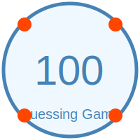

# Number Guessing Game 🎲
---
[In Python]()



---
Welcome to the **Number Guessing Game**! This is a simple C program where you try to guess a randomly selected number between 1 and 100. It's a fun way to test your guessing skills and see how many attempts it takes you to get it right!

## 📜 Description

The game generates a random number between 1 and 100. Your goal is to guess this number. The game will provide feedback on whether your guess is too high or too low and will keep track of the number of attempts you make. You have a maximum of 10 attempts to guess the number correctly.

## 🛠️ Features

- Random number generation between 1 and 100.
- Feedback on whether your guess is too high or too low.
- Attempt counter with a maximum of 10 attempts.
- Friendly and engaging output format.

## 🚀 Getting Started

Follow these instructions to get the game up and running on your local machine.

### Prerequisites

You need to have a C compiler installed on your system. For example, you can use GCC.

### Installation

1. **Clone the Repository**

   ```bash
   git clone https://github.com/mdriyadkhan585/number-guessing-game
   ```

2. **Navigate to the Project Directory**

   ```bash
   cd number-guessing-game
   ```

3. **Compile the Program**

   ```bash
   gcc -o number_guessing_game number_guessing_game.c
   ```

4. **Run the Program**

   ```bash
   ./number_guessing_game
   ```

## 🎮 How to Play

1. **Start the Game**: Run the executable file. The game will generate a random number between 1 and 100.

2. **Make a Guess**: Enter your guess when prompted. The program will tell you if your guess is too high or too low.

3. **Continue Guessing**: You have a maximum of 10 attempts to guess the correct number.

4. **Win or Lose**: If you guess the number correctly within 10 attempts, you'll win the game. If not, the correct number will be revealed at the end.

## 📖 Example Output

```
====================================
   Welcome to the Number Guessing Game!
====================================
I have selected a number between 1 and 100.
Can you guess what it is?

Attempt 1/10
Enter your guess: 50
Your guess is too high! Try again.

Attempt 2/10
Enter your guess: 25
Your guess is too low! Try again.

Attempt 3/10
Enter your guess: 37
Congratulations! You guessed the number 37 in 3 attempts.

Game Over
====================================
```

## Repository Profile 


- **GitHub**: [https://github.com/mdriyadkhan585](https://github.com/mdriyadkhan585)

Happy guessing! 🎉
```
